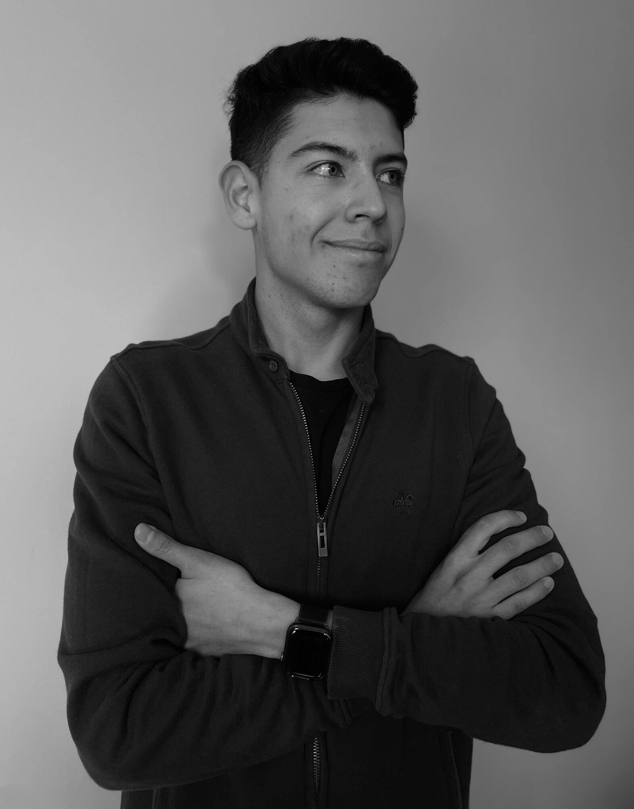

<!-- Intro Section -->
**`Dedicated to putting LATAM on the map as a hub of talent. 🌎🫡`**

  <!-- Name Section -->
  

  <!-- Facts Section -->
  

<!-- Social icons section -->

  
  &#8287;&#8287;&#8287;&#8287;&#8287;
  
  &#8287;&#8287;&#8287;&#8287;&#8287;
  
  &#8287;&#8287;&#8287;&#8287;&#8287;

<!-- About me section -->
<h2 style="color: #abde50;">ABOUT ME 👀</h2>

   
   

      

      I am a curious ML Engineer and Content Creator on a mission to develop solutions that positively impact millions 🌎, leveraging the power of AI with genuine commitment. My goal is to make this impact a reality, one TOKEN at a time, learning every day and building innovative projects focused on helping others. I prioritize rapid shipping and iteration to gain feedback, learn from mistakes, and listen to the community. Through my <a href="https://www.instagram.com/t0mas_baron/">Instagram</a> and <a href="https://www.linkedin.com/in/tomasbaron/">LinkedIn</a>, I share educational content about AI and ML in Spanish, addressing the lack of accessible resources in Spanish-speaking countries. I am dedicated to putting LATAM on the map as a hub of talent.
      

   

<h2 style="color: #abde50;">TECH STACK</h2>
<!-- Tech Stack Section -->

  
  
  
   
   

